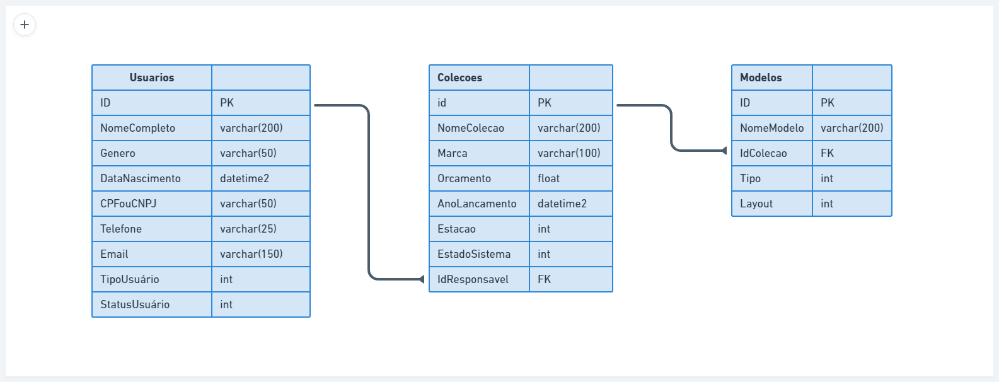

<h1 align="center"> Sobre o projeto </h1>

Esse projeto faz parte do programa de formações de desenvolvedores Full Stack [**DEVinHouse** do lab 365](https://devinhouse.tech/) em parceria com a house [**Audaces**](https://audaces.com/pt-br)

# LAB Clothing Collection

É Um software audacioso para gestão de coleções de moda no setor de vestuário. Nesse repositório está a aplicação Back-End do software, sendo uma API Rest construída utilizando C# e .NET.
Nesta aplicação para gerenciamento de coleções de moda e dos modelos, sendo possivel adicionar, editar e excluir coleções, modelos e usuarios.

## Para ultilizar a aplicação

Para utilizar a aplicação, siga as instruções abaixo:

#### Pré-requisitos

É indicado ter instalado em seu computador [VS 2019](https://visualstudio.microsoft.com/pt-br/) ou superior.

Antes de prosseguir, verifique se o seguinte software está instalado em seu computador: - .NET 5 SDK.

#### Instruções

- Clone o repositório para o seu computador;
- Restaure as dependências do projeto (dotnet restore);
- Compile o projeto (dotnet build);
- É necessário configurar a conexão com o banco de dados.
  Abra o arquivo appsettings.json localizado no diretório raiz do projeto e atualize a string de conexão `ServerConnection` do banco de dados com as informações do seu SQL Server.
- Execute as migrações do banco de dados para criar as tabelas necessárias, mais informações [aqui](https://learn.microsoft.com/en-us/ef/core/managing-schemas/migrations/?tabs=dotnet-core-cli);
- A aplicação está pronta para execução (dotnet run);

## Técnologias utilizadas

`C#`
`.NET`
`SQL Server Express`

## Resumo

Esta API gerência os dados presentes no banco de dados labclothingcolectionbd.
No banco de dados estão presentes três tabelas que são: Usuarios, Coleções e Modelos. Modeladas como na imagem asseguir:

## Mais informações

- Video de apresentação [aqui]()

- Primeira parte do projeto (Front-End) [aqui](https://github.com/TrizCes/labClothingCollection)
